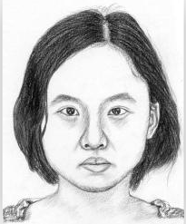

# 2019年终总结 

<a href="https://github.com/HDUMIL-Gao-Group"></img></a>
<a href="https://github.com/xinzi2018"></img></a>
</img>

## 目录
- [2019年终总结](#2019%e5%b9%b4%e7%bb%88%e6%80%bb%e7%bb%93)
  - [目录](#%e7%9b%ae%e5%bd%95)
  - [上半年工作](#%e4%b8%8a%e5%8d%8a%e5%b9%b4%e5%b7%a5%e4%bd%9c)
    - [论文的实验](#%e8%ae%ba%e6%96%87%e7%9a%84%e5%ae%9e%e9%aa%8c)
      - [框架简介](#%e6%a1%86%e6%9e%b6%e7%ae%80%e4%bb%8b)
      - [实验结果](#%e5%ae%9e%e9%aa%8c%e7%bb%93%e6%9e%9c)
    - [论文的补充实验](#%e8%ae%ba%e6%96%87%e7%9a%84%e8%a1%a5%e5%85%85%e5%ae%9e%e9%aa%8c)
      - [在最终论文定稿下的模型下，我们还测试了再不同数据集下的识别率](#%e5%9c%a8%e6%9c%80%e7%bb%88%e8%ae%ba%e6%96%87%e5%ae%9a%e7%a8%bf%e4%b8%8b%e7%9a%84%e6%a8%a1%e5%9e%8b%e4%b8%8b%e6%88%91%e4%bb%ac%e8%bf%98%e6%b5%8b%e8%af%95%e4%ba%86%e5%86%8d%e4%b8%8d%e5%90%8c%e6%95%b0%e6%8d%ae%e9%9b%86%e4%b8%8b%e7%9a%84%e8%af%86%e5%88%ab%e7%8e%87)
      - [在单纯使用sphereface模型的情况下，我们加入模态（p/c）、性别、种族这三种分类](#%e5%9c%a8%e5%8d%95%e7%ba%af%e4%bd%bf%e7%94%a8sphereface%e6%a8%a1%e5%9e%8b%e7%9a%84%e6%83%85%e5%86%b5%e4%b8%8b%e6%88%91%e4%bb%ac%e5%8a%a0%e5%85%a5%e6%a8%a1%e6%80%81pc%e6%80%a7%e5%88%ab%e7%a7%8d%e6%97%8f%e8%bf%99%e4%b8%89%e7%a7%8d%e5%88%86%e7%b1%bb)
  - [下半年工作](#%e4%b8%8b%e5%8d%8a%e5%b9%b4%e5%b7%a5%e4%bd%9c)
    - [CariFaceParsing论文及代码](#carifaceparsing%e8%ae%ba%e6%96%87%e5%8f%8a%e4%bb%a3%e7%a0%81)
    - [针对人脸画像训练一个识别网络](#%e9%92%88%e5%af%b9%e4%ba%ba%e8%84%b8%e7%94%bb%e5%83%8f%e8%ae%ad%e7%bb%83%e4%b8%80%e4%b8%aa%e8%af%86%e5%88%ab%e7%bd%91%e7%bb%9c)
    - [应用singan思路生成人脸素描](#%e5%ba%94%e7%94%a8singan%e6%80%9d%e8%b7%af%e7%94%9f%e6%88%90%e4%ba%ba%e8%84%b8%e7%b4%a0%e6%8f%8f)
  - [接下来的工作](#%e6%8e%a5%e4%b8%8b%e6%9d%a5%e7%9a%84%e5%b7%a5%e4%bd%9c)
  - [附件](#%e9%99%84%e4%bb%b6)
    - [部分论文阅读笔记](#%e9%83%a8%e5%88%86%e8%ae%ba%e6%96%87%e9%98%85%e8%af%bb%e7%ac%94%e8%ae%b0)

## 上半年工作

### 论文的实验

#### 框架简介

在今年上半年的主要工作是使用sphereface论文的思路进行人脸照片以及人脸漫画之间的识别。主要结构如下图所示。对于输入的一张图片（不论漫画还是照片），我们都分别进行了global和local这两种方式进行特征提取，global使用的是sphereface相同的网络结构，而local使用的是轻量级的sphereface（也就是减少cnn层数）。在WebCaricature数据集中含有17个关键点，由此我们将使用17个local网络，分别对应各自的根据关键点裁出来的图片块。接着我们学习了一个权重网络，用来作为这17个local网络得出来特征的比重，将权重乘以各自的特征之后再与global网络的出来的特征进行cat,此时得到的特征我们可以用来做识别。

详细的网络结构如下图所示。

#### 实验结果

### 论文的补充实验

#### 在最终论文定稿下的模型下，我们还测试了再不同数据集下的识别率

|                                         |  p2c   |   p2c   |    c2p |   c2p   |           |            |
| --------------------------------------- | :----: | :-----: | -----: | :-----: | :-------: | :--------: |
| 训练时都对齐                            | rank1  | rank10  |  rank1 | rank10  | rank1_avg | rank10_avg |
| AR_dataset(train 80 test 43)            | 90.70% | 100.00% | 95.35% | 100.00% |  93.03%   |  100.00%   |
| XM2VTS(train 100 test 195)              | 77.95% | 97.44%  | 80.51% | 98.97%  |  79.23%   |   98.21%   |
| CUHK（train 88 test 100）               | 68.00% | 100.00% | 74.00% | 99.00%  |  71.00%   |   99.50%   |
| CUFS(CUHK+AR+XM2VTS)(train 268 test338) | 91.12% | 99.11%  | 91.42% | 99.70%  |  91.27%   |   99.41%   |
| CUFSF（train 250 test 944）             | 78.60% | 97.14%  | 79.45% | 97.25%  |  79.03%   |   97.20%   |
| CASIA-HFB（train 70 test 30）           | 47.50% | 97.50%  | 52.50% | 97.50%  |  50.00%   |   97.50%   |
| VIPSL_FaceSketch（train 133 test 67）   | 91.04% | 100.00% | 82.99% | 99.40%  |  87.02%   |   99.70%   |
| VIPSL Style-A                           | 83.58% | 98.51%  | 85.07% | 98.51%  |  84.33%   |   98.51%   |
| VIPSL Style-B                           | 68.66% | 98.51%  | 72.06% | 97.06%  |  70.36%   |   97.79%   |
| VIPSL Style-C                           | 85.07% | 98.51%  | 86.76% | 98.53%  |  85.92%   |   98.52%   |
| VIPSL Style-D                           | 80.60% | 100.00% | 79.41% | 98.53%  |  80.01%   |   99.27%   |
| VIPSL Style-E                           | 77.61% | 98.51%  | 77.94% | 98.53%  |  77.78%   |   98.52%   |

#### 在单纯使用sphereface模型的情况下，我们加入模态（p/c）、性别、种族这三种分类

下面两张图中第一列表示计算loss过程中身份，模态，性别，种族四者之间的比例。

## 下半年工作

### CariFaceParsing论文及代码

> [详细官方代码实现步骤整理](https://blog.csdn.net/weixin_42105640/article/details/103992644)

简单介绍一下论文所要做的工作，在目前的很多工作都是针对真实人脸照片来生成人脸parsing图，但却有很少可以通过一张漫画图去生成漫画的parsing图。所以本文所做的任务就是去通过Shape Adaptation 和 Texture  Adaptation 这两个模块去生成漫画和漫画parsing，这样便可以通过漫画和漫画的parsing图去训练我们的face parsing Network。

**Shape Adaptation**：

本论文所提出的Shape Adaptation模块主要是受到Spatial Transformer Networks（STN）的启发。我们的方法还包含可微图像扭曲操作（differentiable image warping operation ），以对照片执行合理的形状夸张以捕获形状域偏移。由于没有配对的训练数据可用，所以我们以cycleGAN的方式训练Shape Adaptation模块，**其中STN被插入到图像转换网络中。**

Shape Adaptation预测在照片上的空间扭曲的参数以生成变形的参数。根据这种变形方式，我们将ground truth labels也做相应的形变。

**Texture Adaptation**：

在shape Adaptation之后，我们可以得到形变后的人脸照片和形变后的parsing图，在texture中我们主要是为了将形变后的人脸照片进行漫画的风格迁移。在该结构中我们使用conditional information（style Selector）去得到多风格的texture generation。（该部分模型的输入为形变后的人脸照片和style Selector。）

在训练这个模型的时候，我们使用的是content loss和style loss[1]。对于content loss 我们将生成的漫画和形变的照片用VGG模型提取出Conv4-2层的特征。目的是加强生成的漫画，并保存变形照片的结构。对于style loss我们用Batch Normalization (BN)的统计量代替Gram matrices的统计量来计算特征。然后，以生成的漫画与参考漫画图像的特征差异为特征，得出style loss。

### 针对人脸画像训练一个识别网络

我们在计算FID的时候使用的是InceptionV3网络，而该网络是在ImageNet数据集上训练的，由于该数据集并非是素描画像，所以我们在使用该网络下的FID去计算指标的时候似乎有些牵强和不精准。所以接下来的工作是想要训练一个针对人脸画像的网络，可以更好的对人脸素描图片进行特征提取。

1. 使用CUFS数据集训练vggface模型，并将训练好的网络用于特征提取，用来替换InceptionV3
2. 用CUFS数据集中sketch数据去训练pix2pix模型，并使用pix2pix中的encoder去特征提取，以此来替换InceptionV3

> 详细实验结果见[xinzi2018/mystudy](https://github.com/xinzi2018/mystudy)

### 应用singan思路生成人脸素描

> 详细实验报告见 [HDUMIL-Gao-Group/SinGAN-for-Sketch](https://github.com/HDUMIL-Gao-Group/SinGAN-for-Sketch)

（1）首先测试了原singan论文代码，发现在静物的生成上效果非常好能够达到论文中描述的效果，但是在训练sketch的时候就会发现由于随机噪声参与，会导致生成的人脸五官有着很明显的混乱和扭曲。

（2）根据 1 所发现的问题，我们将对网络输入进行改进——加入sketch对应的photo,用来作为条件。也就是说每一层的输入为：随机噪声加上上一层生成的sketch_fake之后与photo_real作cat处理。

此时在输入训练集photo之后生成的图片不再出现五官混乱扭曲的情况了。（左：输入；中：生成；右：原sketch）

然而同时有一个问题随之而来，那就是我们测试时如果输入不同与训练集的photo的时候，是否会生成合理的sketch。

上图结果可以发现在输入其他图片测试的时候效果很不佳。

（3）所以在接下来的工作中我们希望能够在多张图片的训练集中训练网络，使得网络能够具有鲁棒性，在测试时达到不论输入什么样的人脸照片都能够得到对应的sketch的效果。

在该部分实验过程中，大框架下有两种训练方式：1.所有图片训练完当前层模型之后，在使用所有图片训练下一层模型，此时下一层模型的初始化参数是上一层训练结束后的参数（原论文层级递增时参数初始化方式）。2.使用其中一张图片一次性训练完所有模型并保存下所有模型参数，接着使用第二张图片去微调上一张图片训练结束后保存下来的模型。）**（注：根据singan论文的训练特点，可以发现第二种方式更符合singan思想）**。

但由于一开始采用了第一种方式来实验，并且也发现了效果还可以，故而第二种方式有待尝试，也会在之后的工作中继续扩展。

使用的数据集为CUFS数据集（268张训练，338张测试）

下面将通过：
1. G模型 （原singan中5层conv、使用u_net结构）
2. epoch 
3. 训练层数（10/5）
4. 是否使用toRGB 和 fromRGB 
5. 是否需要噪声

这五种情况在对训练结果进行观察。

- 首先测试了在原singan结构下（只将输入修改成了多张训练集）的模型。(conv+layer10)
- 使用u_net+layer5+to/fromRGB+noise(分别测试了不同epoch下的结果图)
- 使用u_net+layer5+to/fromRGB+nonoise(分别测试了不同epoch下的结果图)

> 由于实验结果比较多，详细结果可见 [HDUMIL-Gao-Group/SinGAN-for-Sketch](https://github.com/HDUMIL-Gao-Group/SinGAN-for-Sketch)

## 接下来的工作

1. 测试在3.2（3）中提到的第二种训练方式，并测试在这样的训练情况下是否需要加入noise。
2. 对于D判别网络，单个D的效果与多个D判别器哪一个达到的效果更佳。
3. 使用测试数据集对以上方式训练的模型进行测试，并计算指标：FID，SSIM，PSNR，FSIM，KID，IS，FisherFace， EigenFace等。
4. 使用gauGAN的思想在模型中加入spade。

## 附件

### 部分论文阅读笔记

- [ESRGAN: Enhanced Super-Resolution Generative Adversarial Networks](https://blog.csdn.net/weixin_42105640/article/details/99415696)
- [Photo-Realistic Single Image Super-Resolution Using a Generative Adversarial Network](https://blog.csdn.net/weixin_42105640/article/details/99415504)
- [Distilling With Residual Network for Single Image Super Resolution](https://blog.csdn.net/weixin_42105640/article/details/99415220)
- [Adversarial Discriminative Heterogeneous Face Recognition](Adversarial Discriminative Heterogeneous Face Recognition)
- [Improving Heterogeneous Face Recognition with Conditional Adversarial Networks](https://blog.csdn.net/weixin_42105640/article/details/97497796)
- [Face Recognition from Multiple Stylistic Sketches: Scenarios, Datasets, and Evaluation](https://blog.csdn.net/weixin_42105640/article/details/97394524)
- [WarpGAN: Automatic Caricature Generation](https://blog.csdn.net/weixin_42105640/article/details/88050517)
- [Unpaired Photo-to-Caricature Translation on Faces in the Wild](https://blog.csdn.net/weixin_42105640/article/details/87966779)
- [SphereFace: Deep Hypersphere Embedding for Face Recognition](https://blog.csdn.net/weixin_42105640/article/details/87780884)
- [Photo-to-Caricature Translation on Faces in the Wild](https://blog.csdn.net/weixin_42105640/article/details/87474666)
- [WebCaricature: a benchmark for caricature face recognition](https://blog.csdn.net/weixin_42105640/article/details/87366365)
- [CariGAN: Caricature Generation through Weakly Paired Adversarial Learning](https://blog.csdn.net/weixin_42105640/article/details/87342635)
- [Distilling With Residual Network for Single Image Super Resolution](https://blog.csdn.net/weixin_42105640/article/details/103980121)