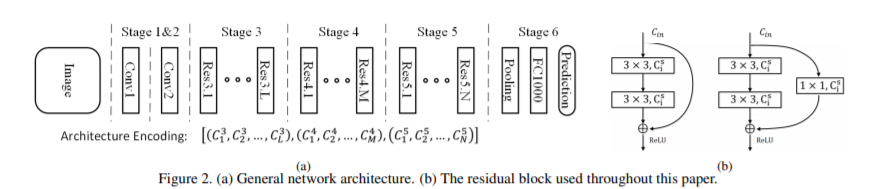
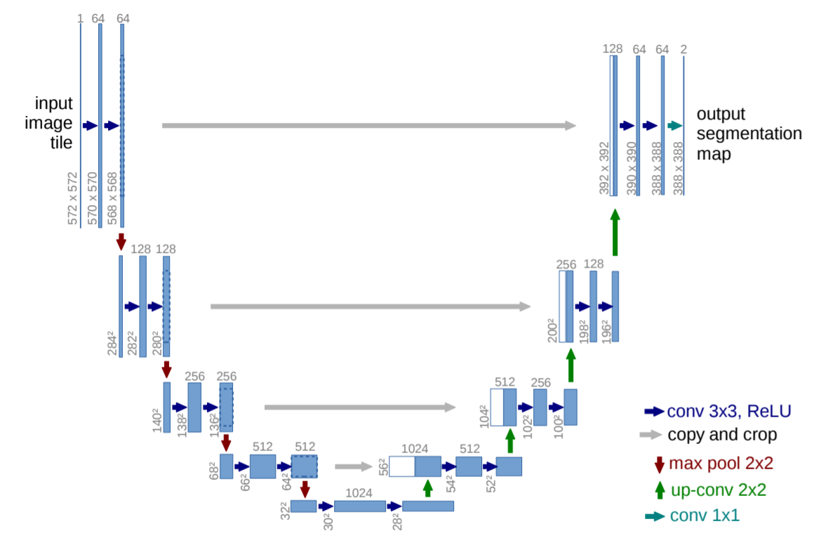

# 2019 年度工作报告

    姓名:沈傅豪 学号:17052021

## 目录

[TOC]

## 摘要

2019 年中我完成了大学生涯中的第一个转变,第一次一个人完成了一个较为简单的实验.上半年主要是做一些积类,看看论文学习 pytorch.暑假则是参加了研究生的入门课程,第一次系统的学习了机器学习与深度学习的相关知识.下半年则是参与了一个肺结节检测项目,并且初步完成一个简单的医学分割.总体来说,这一年受益匪浅.也发现了许多不足之处,比如做事比较拖拉,导致进度很慢.在新的一年中希望能改变这些缺点.感谢高老师这两年来的耐心指导.

## 2019 年历程概述

### 上半学期

2019 年的上半学期,在创新实践课上学习到了机器学习以及深度学习的相关知识,便被深度学习在医学领域的应用深深的吸引,也,在上创新实践课时,学习到了机器学习相关的基础知识,也在课余看了几篇较为基础的论文比如'Image-to-Image Translation with Conditional Adversarial Networks','R-CNN',On the Automatic Generation of Medical Imaging Reports'等等论文,并且在上半个学期申报了大创项目:'基于深度学习的肺癌淋巴结转移预测模型',该项目成功的申请了校级项目,虽然没有成功的通过国家级评选,但是准备这一项目仍然使我受益匪浅.虽然没有成功申请国家级,但是我仍然将这一项目作为一次机会,好好锻炼个人能力.

### 暑假

通过高老师的推荐,暑假我参加了媒体智能实验室 2019 暑期班,在这里我第一次系统的学习了机器学习与深度学习的相关知识,也学习了许多基础知识,使我受益匪浅.在这个过程中我也认识了方楠师兄,在接下来的半个学期里,他给予了我许多深度学习方面的经验与知识,每次与他交谈总能学到许多新知识.

### 下半学期

下半学期中,我将我的主要精力用在了'基于深度学习的肺癌淋巴结转移预测模型'这一项目的完成上.我本以为这个学期会是我的一个较为悠闲的学期,可以花费更多的时间完成'基于深度学习的肺癌淋巴结转移预测模型'这一项目,但是这个学期课程作业却出奇的多,大部分时间我都在写课后作业,这也就使得这一学期我得相关工作得进展十分缓慢.在这半年时间里我完成了'Partial Order Pruning: for Best Speed/Accuracy Trade-off in Neural Architecture Search'代码的实现,并且成功的将 autoML 应用到了肺结节检测中.在真正的参与项目的这半年时间中,我也深刻的意识到了自己身上的不足之处,比如许多基础知识并没有完全的掌握,这也影响了我后期的工作进度.还有就是代码能力不够强,在写一些较为简单的代码时,仍需要花费大量时间.还有就是做事拖拉,还喜欢玩游戏,因此工作的进度大大拖慢.

## 2019 的相关工作

### 基于深度学习的肺癌淋巴结转移预测模型

#### 工作简介

主要为对肺结节进行分类,确定其是否为阳性,这一工作主要是基于许兴歆师兄发表的一篇论文,在那篇论文的基础上我增加了 AutoML 的相关内容,来进一步提高精度,并且减小模型的规模,使得该模型更加具有实用性.并且增加 ResCBAM 模块,并且使用了较为新的损失函数:sphereface,并且使用了随机森林.从而获得了较好的实验结果

#### 数据集说明

这一实验所用到的数据集为邵逸夫医院提供的病人数据,总共训练集总共有 912 个数据,阳性数据有 413 个,阴性数据共有 499 个,总体来说数据较为平衡.测试集共有 10 组,每组的数量各不相同,但是总体来说分布较为均匀.我最终选择了前六个测试集作为最终的测试集

#### 实验模型

##### Partial Order Pruning: for Best Speed/Accuracy Trade-off in Neural Architecture Search

我主要使用了这篇论文中主体模型如下图:

并且使用了其中的 AutoML 的相关算法,对模型的深度以及宽度组合进行了搜索,具体算法如下:

在这篇论文的基础上我做了小小的改进,由于之前这篇论文所使用的搜索空间过大,我对深度与宽度进行了进一步的限制,使得搜索空间变小加快了模型搜索

##### ResCBAM

本模型中我还加入了注意力机制,我使用了 ResBlock+CBAM 的组合,从而让模型能更好的注意到一些关键点,从而提高正确率

##### sphereface

在本模型中我尝试了全新的损失函数:sphereface,并且取得了不错的效果,发现该损失函数对于模型的正确率有着一定的促进作用.该损失函数主要使用角度作为损失函数:

##### 随机森林

在这个项目中,我尝试了类似随机森林的做法,即使用多个搜索出来的模型进行投票,来判断肺结节.出人意料的是,这效果格外的好,甚至可以提升 2 个百分点的精度!

#### 搜索结果

由于结果过多在这里我只贴出部分结果
| 序号 | config | acc | lnt |
| :---: | :---------------------------------------------------------------------------: | :----------: | :----------: |
| 0 | \[[128, 256, 256, 256, 256, 256], [512, 512, 512], [512, 512]] | 64\.13043478 | 2\.261250257 |
| 1 | \[[64, 64, 256, 256], [256, 256, 256, 256], [256, 256, 512, 512, 512]] | 76\.08695652 | 1\.209807873 |
| 2 | \[[64, 64, 64], [64, 128, 128, 128, 128, 128, 128], [128, 128, 128, 512]] | 73\.91304348 | 0\.604509592 |
| 3 | \[[64, 64, 64, 64, 128, 128], [256, 256, 256, 256], [256, 256, 512, 512]] | 66\.30434783 | 0\.962049007 |
| 4 | \[[64, 64, 64, 64], [64, 256, 256, 256], [512, 512, 512, 512]] | 55\.43478261 | 0\.806409836 |
| 5 | \[[64, 64, 256, 256, 256, 256], [256, 256, 256], [256, 512, 512, 512, 512]] | 59\.7826087 | 1\.583779335 |
| 6 | \[[64, 64, 64], [64, 64, 64, 64], [64, 256, 512, 512, 512, 512, 512]] | 78\.26086957 | 0\.644768953 |
| 7 | \[[64, 128, 128], [128, 256, 256, 256, 512, 512], [512, 512, 512]] | 65\.2173913 | 1\.063189507 |
| 8 | \[[64, 64, 64, 64], [64, 64, 64, 64, 256], [256, 512]] | 81\.52173913 | 0\.473498821 |
| 9 | \[[64], [64, 64, 256], [512, 512]] | 83\.69565217 | 0\.344322443 |
| 10 | \[[64, 64, 64], [64, 128, 128, 256, 256], [256, 256, 256, 512, 512, 512]] | 73\.91304348 | 0\.714242935 |
| 11 | \[[64, 128, 128], [128, 128, 128, 128], [128, 128, 128, 256, 256, 512]] | 59\.7826087 | 0\.612253189 |
| 12 | \[[64, 64, 64, 64, 64], [64, 128, 128], [128, 128, 512, 512]] | 81\.52173913 | 0\.670095205 |
| 13 | \[[128, 128, 512], [512, 512], [512, 512]] | 79\.34782609 | 1\.180781364 |
| 14 | \[[128, 256, 256, 256, 256, 256, 256], [256, 256, 256], [256, 256, 256, 256]] | 75 | 1\.937175751 |
| 15 | \[[64, 128, 128], [256, 256, 256], [256, 512, 512, 512, 512, 512, 512, 512]] | 47\.82608696 | 0\.649701357 |
| 16 | \[[64, 128, 128, 128], [128, 128, 128, 512, 512], [512, 512, 512, 512]] | 57\.60869565 | 0\.961740494 |
| 17 | \[[64, 64, 64, 64], [64, 64, 128, 128], [128, 128, 128, 256, 256, 512]] | 78\.26086957 | 0\.677764416 |
| 18 | \[[128, 128, 128, 128], [128, 128, 128, 128, 128], [128, 512, 512, 512]] | 68\.47826087 | 0\.939599037 |
| 19 | \[[64, 64], [256, 256, 256, 256, 256], [256, 256, 256]] | 69\.56521739 | 0\.508063793 |
| 20 | \[[64, 256, 512, 512], [512, 512, 512, 512, 512, 512, 512], [512, 512, 512]] | 73\.91304348 | 2\.332449436 |

#### 实验结果

实验结果过于复杂这里放不下,我会额外放一个 excel 文件

| 模型                                                                   | log\-0 acc | log\-1 acc | log\-2 acc | log\-3 acc | log\-4 acc | log\-5 acc | acc          |
| ---------------------------------------------------------------------- | ---------- | ---------- | ---------- | ---------- | ---------- | ---------- | ------------ |
| spcbam[4,4,[8, 8, 8], [16, 16, 16], [32, 32]]                          | 80\.434    | 84\.112    | 87\.387    | 88\.349    | 87         | 92\.391    | 86\.61216667 |
| spcbam[4,4,[8, 32], [64, 64, 64], [64, 64, 128, 128]]                  | 81\.521    | 85\.981    | 85\.585    | 88\.349    | 85         | 90\.217    | 86\.10883333 |
| spcbam[4,4,[8, 16, 16], [16, 32, 64], [128, 128]]                      | 85\.869    | 84\.112    | 88\.288    | 88\.349    | 85         | 91\.304    | 87\.15366667 |
| spcbam[4,4,[64, 64, 64, 64], [64], [128, 128]]                         | 82\.608    | 85\.046    | 84\.684    | 89\.32     | 88         | 93\.478    | 87\.18933333 |
| spcbam[4,4,[4, 8, 16, 16, 16], [32, 128], [128]]                       | 82\.608    | 85\.981    | 86\.486    | 88\.349    | 88         | 93\.478    | 87\.48366667 |
| spcbam[32,64,[64], [64], [64, 64, 128, 128]]                           | 82\.608    | 87\.85     | 86\.486    | 88\.349    | 87         | 90\.217    | 87\.085      |
| spcbam[32,64,[64], [64, 64, 256], [512, 512]]                          | 83\.695    | 85\.046    | 87\.387    | 88\.349    | 88         | 92\.391    | 87\.478      |
| spcbam[32,64,[64, 64], [64, 64], [64, 128, 512, 512, 512]]             | 82\.608    | 86\.915    | 85\.585    | 88\.349    | 88         | 90\.217    | 86\.94566667 |
| spcbam[32,64,[64, 64], [64, 128, 128, 128, 128], [256, 256, 512, 512]] | 81\.521    | 87\.85     | 87\.387    | 90\.291    | 90         | 91\.304    | 88\.05883333 |

### CT 图像分割

#### 工作说明

本项目的工作是训练一个模型用于对腹腔 CT 图进行分割，我们选择的模型为 U-Net

#### 数据说明

数据中包括五种文件

1. .DCM 文件：CT 图像源文件，可以用 Photoshop 打开
2. .DCM.tag 文件：病人描述以及 tag 描述文件，用记事本打开，但是会乱码
3. .txt 文件：经过转码的文本文件，病人描述以及 tag 描述文件，可以用 Gb2312 打开
4. .jpg 文件：经过标记的 CT 图像，尺寸为 512x512
5. src.jpg 文件：未被标记的 CT 图像，尺寸为 512x512

#### 分割区域说明

该 CT 图为腹腔的 CT 图，该图分为四种区域

1. 背景区域：在标记图中表现为黑色或者灰色
2. 皮下组织：颜色为黄色
3. 皮下肌肉组织：颜色为红色
4. 内脏脂肪：颜色为蓝色

#### 数据预处理

##### 数据处理步骤

1. 读取文件夹中所有标记图片(.jpg)和原始图片(src.jpg)
2. 对标记图片与原始图片进行配对，删除不配对图片与异常图片
3. 将图像缩小未 128x128
4. 根据标记图片生成相应 label，此处的 label 为相应图片每个像素位置的所属的种类

##### 数据存在的问题

- 有标记图像但是没有原始图像
- 图像未进行正常的标记
- 标记图中同一类别的像素不同

##### 数据集划分

数据集共有 234 对数据，我们将其划分为

- 训练集：211 对
- 测试集：23 对

#### 模型训练

##### 模型选择

我们选择使用 U-Net 作为我们的模型进行图像分割

##### 训练参数

- 损失函数：CrossEntropyLoss
- 优化器：SGD
- 训练 epoch：500

##### 实验结果

train loss

test loss

评价指标

##### 模型输出

#### 实验结论

1. 总体来说，模型的分割效果还可以，对于绝大部分图片都能获得较好的结果
2. 该分割模型在进行分割时，由于蓝色区域十分乱，因此对于蓝色区域的分割效果最差
3. 在对较窄的红黄区域划分时分割效果也比较差

#### 模型改进

##### Hybrid Dilated Convolution

利用 Hybrid Dilated Convolution 代替 MaxPooling，解决特征丢失的问题

### 安全帽识别

#### 工作简介

基于深度学习的车间安全帽检测系统，实现生产环境安全帽佩戴情况的实时检测。通过对未佩戴安全帽的工作人员进行警告，保证每一个施工人员按照操作规范进行作业，从而保障工人的安全.这一项目是我在寒假之前申报的一个服务外包项目,尝试申请了新苗计划,但是由于准备不充分落选了,我们打算在校级申报的时候再尝试一下,目前该项目只有一个大致的方案

#### 项目背景

《中华人民共和国安全生产法》确定的安全生产管理基本方针为“安全第一、预防为主、综合治理”。要求在生产过程中，必须坚持“以人为本”的原则。在生产与安全的关系中，一切以安全为重，安全必须排在第一位。必须预先分析危险源，预测和评价危险、有害因素，掌握危险出现的规律和变化，采取相应的预防措施，将危险和安全隐患消灭的萌芽状态。
保护劳动者的生命安全和职业健康是安全生产最根本、最深刻的内涵，是安全生产本质的核心。它充分揭示了安全生产以人为本的导向性和目的性，它是我们党和政府以人为本的执政本质、以人为本的科学发展观的本质、以人为本构建和谐社会的本质在安全生产领域的鲜明体现。
生产安全是每一个企业需要重视的一环。目前，高危区域的安全帽佩戴情况还主要依靠个人自觉，难以保证每个人员佩戴好安全设施，这无形中增加了很多安全隐患。为了有效解决这个问题，项目旨在开发高效精准的安全帽检测系统，对于未按要求佩戴好安全帽的人员发起安全警报，起到一定监管作用，从而有效降低安全隐患。

#### 项目内容

通过摄像头采集图像数据，开发算法模型，实现生产环境安全帽佩戴情况的实时检测，对区域内未佩戴安全帽的人员进行安全警告，有效降低安全隐患。安全帽识别系统主要具有以下功能：

1. 对区域实时分析识别与预警
   应用视频监控的实时视频对工作人员的安全帽佩戴情况进行实时识别和检测，对未佩戴安全帽的危险行为可实时监测和预警，告警视频、截图都可以在客户端显示，可以在现场部署音响和扬声器给出警告提示。根据用户的需求也可以将警告信息推送给相关管理人员，协助管理人员安全生产管理。
2. 警告记录存储
   安全帽识别系统可对未佩戴安全帽的警告截图和视频及时存储到服务器数据库中，包括时间、地点、警告截图、警告视频等形成报表信息，方便人员安全管理。
3. 警告记录快速查询
   高效的警告记录快速查询能够根据时间段、监控区域对未佩戴安全帽的行为进行警告查询，对查询到的多条记录以报表的形式展示，每条记录有详细的警告截图和视频。
   项目旨在基于智能视频分析和深度学习技术，开发识别率高、部署快捷、操作简单的智能安全帽实时检测系统。实时监测识别和预警，在实时性和准确率有一定要求。开发兼容性强、性能稳定、可与更多的行业集成的系统，实现更多的物联网智能化应用。

#### 项目方案

目前该领域所面对的主要问题为:

1. 由于距离的远近,人脸在视频中的大小相差极大,使得识别难度增加。
2. 背景过于复杂,使得识别精度较低。
3. 于目前常用的目标跟踪方案主要为 mask-RCNN 等深度学习模型,这类模型对硬件计算能力要求极高。针对以上几个问题我们提出了相应的解决方案：

首先问题 1 的出现主要因为基础的卷积神经网络,主要有卷积层以及池化层构成。该结构具有着较大的局限性,首先池化层虽然保留了较为重要的信息,但是却存在一个致命的缺点:必然会导致部分信息丢失且无法通过上采样恢复这些信息。这也就使得部分小区域的人脸无法被识别。我们提出的解决方案为使用分层扩张卷积代替池化层,保留所有的特征信息来保证正确率。

我们决定使用 FPN+MSB 的模型结构

针对问题 2,实际上这是深度学习中一直都存在的问题,卷积神经网络有着较弱的抵抗外界影响攻击的能力,即同一个东西仅仅是换一个角度换一个便会获得完全不同的结果.针对这一问题我们选择利用 AutoGAN 来处理这些外界的影响,主要思路就是利用 GAN 中的生成器对输入图像进行解析,将其映射到较低维度,从而排除影响因素.接着将判别器作为一个分类器,凭借着其较强的分类能力,提高正确率。其主要结构为

针对问题 3,影响模型的运行速率的主要因素为模型的深度与广度,模型的精度与广度又同时影响着模型的正确率。我们选择利用 AutoDL 对整个分类器模型进行搜索,找到较好的模型深度与广度的组合,在正确率以及模型精度中找到一个较好的平衡点.以下为算法的主要步骤:

最终我们提出了一个模型其结构为:

## 2019 的收获与感想

2019 年对于我来说是一个收获的一年,因为相比于前两年来说,我学到了更多知识.最重要的是,发现了一个自己真正感兴趣的东西:医学在深度学习的应.也给予了我更多动力,让我知道了未来我要做些什么,不会再像前两年那样迷茫.这一年的参与项目的经历让我发现了我自己身上许多的不足,比如做事拖沓,爱玩游戏,工作进度慢等等缺点.希望在接下来一年中可以改掉做事拖沓的习惯.很感谢高老师这么久以来对我不厌其烦的教导我,对我各种缺点的忍耐,并且给予了我许多帮助.

## 2020 年的计划

2020 年,要完成基于深度学习的肺癌淋巴结转移预测模型这一项目并且发表论文.这一年除了医疗相关的项目外,我还希望接触一下风格变换这类的项目.在上半年中全身心的投入相关项目,在下半年以及暑假要复习考研.
